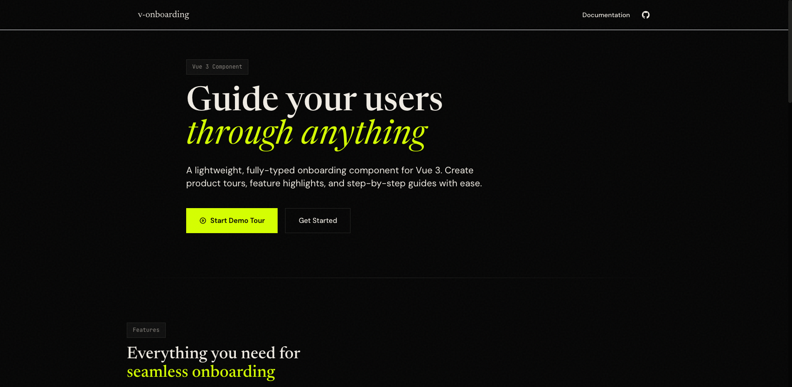

<div align="center">

# v-onboarding

A fully-typed, customizable onboarding component for Vue 3

> Looking for React? Check out [r-onboarding](https://github.com/fatihsolhan/r-onboarding)

[](https://www.npmjs.com/package/v-onboarding)
[](https://www.npmjs.com/package/v-onboarding)
[](https://www.npmjs.com/package/v-onboarding)
[](https://v-onboarding-docs.fatihsolhan.com/guide/nuxt)

[Demo](https://v-onboarding.fatihsolhan.com/) · [Documentation](https://v-onboarding-docs.fatihsolhan.com/)



</div>

---

## Features

- **TypeScript First** - Full type support out of the box
- **Customizable UI** - Use default styling or bring your own with slots
- **Accessible** - Built-in focus trap for keyboard navigation
- **Flexible Positioning** - Smart tooltip placement with Popper.js
- **SVG Overlay** - Highlight elements with customizable overlay
- **Lifecycle Hooks** - `onBeforeStep`, `onAfterStep` for custom logic

## Installation

```sh
# npm
npm install v-onboarding

# yarn
yarn add v-onboarding

# pnpm
pnpm add v-onboarding
```

## Nuxt

For Nuxt 3+ applications, use the built-in module:

```ts
// nuxt.config.ts
export default defineNuxtConfig({
  modules: ['v-onboarding/nuxt']
})
```

Components, composables, and styles are auto-imported. See the [Nuxt guide](https://v-onboarding-docs.fatihsolhan.com/guide/nuxt) for configuration options.

## Quick Start

```vue
<script setup lang="ts">
import { ref } from 'vue'
import { VOnboardingWrapper, VOnboardingStep } from 'v-onboarding'
import 'v-onboarding/dist/style.css'

const wrapper = ref(null)
const steps = [
  {
    attachTo: { element: '#feature-1' },
    content: { title: 'Welcome!', description: 'Let me show you around.' }
  },
  {
    attachTo: { element: '#feature-2' },
    content: { title: 'Next Feature', description: 'Here is another feature.' }
  }
]
</script>

<template>
  <VOnboardingWrapper ref="wrapper" :steps="steps" />

  <button @click="wrapper?.start()">Start Tour</button>

  <div id="feature-1">Feature 1</div>
  <div id="feature-2">Feature 2</div>
</template>
```

## Using Vue Template Refs

You can attach steps to elements using Vue template refs:

```vue
<script setup lang="ts">
import { ref } from 'vue'
import { VOnboardingWrapper } from 'v-onboarding'
import 'v-onboarding/dist/style.css'

const wrapper = ref(null)
const buttonRef = ref(null)

const steps = [
  {
    attachTo: { element: buttonRef },
    content: { title: 'Click me!', description: 'This button uses a template ref.' }
  }
]
</script>

<template>
  <VOnboardingWrapper ref="wrapper" :steps="steps" />
  <button ref="buttonRef" @click="wrapper?.start()">Start Tour</button>
</template>
```

## Custom Step UI

Use the default slot to create your own step UI:

```vue
<VOnboardingWrapper ref="wrapper" :steps="steps">
  <template #default="{ step, next, previous, exit, isFirst, isLast }">
    <VOnboardingStep>
      <div class="my-custom-tooltip">
        <h3>{{ step.content.title }}</h3>
        <p>{{ step.content.description }}</p>
        <button v-if="!isFirst" @click="previous">Back</button>
        <button @click="isLast ? exit() : next()">
          {{ isLast ? 'Finish' : 'Next' }}
        </button>
      </div>
    </VOnboardingStep>
  </template>
</VOnboardingWrapper>
```

## Styling

Customize the overlay and tooltips with CSS variables:

```css
:root {
  --v-onboarding-overlay-z: 10;
  --v-onboarding-step-z: 20;

  /* SVG Overlay */
  --v-onboarding-overlay-fill: rgba(0, 0, 0, 0.75);

  /* Tooltip */
  --v-onboarding-step-arrow-background: white;
}
```

## Documentation

For full documentation including all props, events, hooks, and examples, visit the [documentation site](https://v-onboarding-docs.fatihsolhan.com/).

## License

MIT
